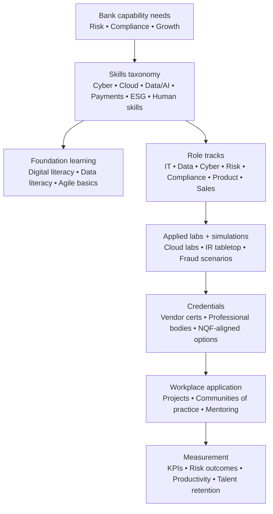
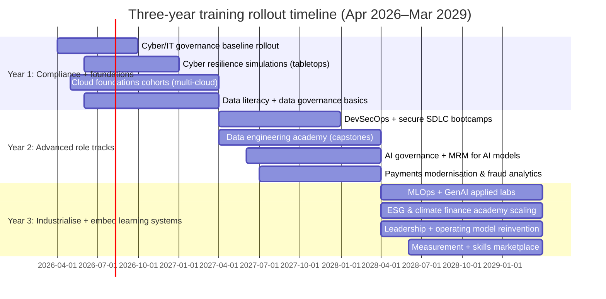

# Skills Shortages and Training Priorities for the South African Banking Sector 2026–2029

## Executive summary

South African banking is entering a three‑year period where *regulatory technology obligations* and *competitive digital transformation* reinforce each other, creating acute skills shortages in cyber resilience, cloud engineering, data/AI, modern risk management, and digitally enabled customer operations. The strongest near‑term pressure comes from enforceable supervisory requirements (IT governance/risk, cybersecurity and cyber resilience, incident notification expectations and third‑party risk management) and from banks’ strategic shift of core systems and operating models toward cloud compute and data‑driven delivery. citeturn11view0turn17view0turn17view2turn32view0

Across sector workforce planning evidence, the pattern is consistent: (1) advanced digital roles (data management, software development, ICT security) remain hard‑to‑fill; (2) “skills gaps” persist across both technical and managerial occupations, with lack of experience and new technology frequently cited as root causes; and (3) new/emerging occupations explicitly include AI/ML specialists, data engineers, cybersecurity personnel, and sustainability specialists—signalling that the skills shortage is not only expected but already structurally embedded. citeturn7view1turn7view3turn5view1

A training organisation serving South African banks should therefore prioritise a portfolio that is **compliance‑tight, role‑specific, and capability‑building**, not generic. The recommended training priorities are:

- **Cybersecurity and cyber resilience (highest urgency, highest impact)** aligned to Joint Standard 2 of 2024 effective 1 June 2025 and operational resilience expectations (governance, controls, incident response, reporting, and cyber culture). citeturn13search4turn11view0turn17view0turn19view2  
- **IT governance and technology risk management** aligned to Joint Standard 1 of 2023 (effective 15 November 2024), and embedded within enterprise risk and audit operating models. citeturn17view0turn17view0  
- **Cloud engineering + DevSecOps + cloud security**, reflecting banks’ strategic transition/refinement of core systems toward cloud compute capability and multi‑cloud adoption (including skills for secure migration, identity, network controls, observability, resilience and cost discipline). citeturn32view0turn28view3turn22search13  
- **Data engineering, analytics, and data governance (with privacy)** because data capability sits underneath AI, fraud control, customer personalisation, regulatory reporting and operational automation; job‑market signals repeatedly reference ETL, enterprise data warehousing, DLP and privacy obligations. citeturn5view1turn20view0turn19view2turn28view2  
- **AI/ML and “responsible GenAI” (governance, explainability, model risk)** because supervisory research already identifies *insufficient talent/access to skills* and *transparency/explainability* as leading constraints to AI adoption, and highlights a “notable shortage” of AI/ML/data analytics professionals. citeturn15view0turn16view1turn16view0  
- **Payments modernisation and digital customer experience**, driven by modernisation of the National Payments System and competitive mobile‑first growth; and **human skills** for cross‑functional delivery, customer engagement, and change leadership—because skills gaps are repeatedly observed in critical thinking, complex problem solving, and managerial capability. citeturn8view0turn6view1turn7view3turn32view0

The proposed implementation approach is a **three‑year phased plan**: Year 1 focuses on regulatory readiness and foundational capability; Year 2 expands advanced role tracks and certifications; Year 3 industrialises AI/data/product capability and embeds continuous learning systems (skills assessment, pathways, internal mobility, communities of practice). This aligns with evidence that skill change is accelerating, with LinkedIn estimating that by 2030, 70% of skills used in most jobs will change, with AI as a catalyst. citeturn21search0turn21search4

## Evidence base and current skills baseline

### Evidence base used in this report

This analysis triangulates:

- Workforce planning evidence from entity["organization","BANKSETA","banking seta, south africa"] sector skills planning (hard‑to‑fill vacancies, skills gaps, emerging occupations). citeturn7view1turn7view3turn5view1  
- Regulatory and supervisory drivers from entity["organization","Prudential Authority","south africa prudential regulator"] and entity["organization","Financial Sector Conduct Authority","south africa conduct regulator"] instruments and research (AI adoption, IT governance, cyber resilience, third‑party risk management). citeturn17view0turn11view0turn15view0turn17view2  
- Industry signals from entity["organization","PwC","professional services firm"] major banks analysis and cyber survey reporting, plus selected global thought leadership from entity["organization","LinkedIn","professional network company"] and entity["organization","World Economic Forum","international organization"]. citeturn32view0turn30view1turn21search0turn21search29  
- Bank‑level evidence from public reporting and job‑market proxies (sample postings and public career content). citeturn28view1turn19view2turn20view0turn2search9  
- South African labour market context from entity["organization","Statistics South Africa","national statistics agency"] (used only to frame supply‑side constraints and unemployment/skills mismatch). citeturn29search7turn29search14  

### Key baseline observations

**Baseline signal from sector workforce planning:** The banking sector’s own skills planning evidence indicates persistent shortages in both *client‑facing commercial capability* and *advanced digital roles*. Top hard‑to‑fill vacancies include Sales Manager, Credit/Loans Officer, Data Management Manager, Software Developer, ICT Systems Analyst, Data Scientist and ICT Security Specialist, among others. citeturn7view1turn6view0

**Baseline signal from “skills gaps by occupation”:** Skills gaps are repeatedly recorded in roles spanning management, credit, finance, project management and software development—showing that technology change is stressing both technical and managerial labour markets. BANKSETA attributes skills gaps largely to lack of relevant experience and the impact of new technology/work processes in multiple occupations. citeturn7view3turn5view0

**Emerging occupations list as a forward indicator:** BANKSETA explicitly lists new/emerging occupations including AI/ML specialists, data engineers, cybersecurity personnel and sustainability specialists—each tied to digitalisation/new technologies, changing customer expectations, ESG requirements, and regulatory/cyber‑crime drivers. citeturn5view1

**Evidence of increasing training spend but continuing scarcity:** Some major banks report substantial skills development investment and targeted “critical skills” allocation. For example, Absa reports R581m invested in skills development (with a large share allocated to critical skills), and describes a dynamic skills strategy and capability academies. citeturn28view1

**Job‑posting evidence supports the same shortage profile:** A sample cyber role describes specialised controls (DLP, email/web security, SSE, ZTNA), and explicitly links technical security policy to regulatory requirements (POPIA, GDPR, PCI‑DSS). A sample data engineering role emphasises ETL into enterprise data platforms and automated deployment frameworks. citeturn19view2turn20view0

### Assumptions used for planning

This report makes the following explicit assumptions where sector‑wide data is incomplete or inconsistent:

- The planning horizon is **April 2026 to March 2029** (three years from the current date in South Africa).  
- “Urgency” reflects *time‑to‑risk* (e.g., regulatory effective dates, current vacancy pressure, or near‑term strategic dependency). “Impact” reflects potential effect on risk, cost, revenue, stability, and customer outcomes if the skill shortage persists.  
- Job‑posting analysis is **indicative, not exhaustive**: postings shift quickly and platforms vary in visibility; the report uses publicly accessible samples and bank career content as a proxy for demand signals. citeturn19view2turn20view0turn2search9  

## Demand drivers shaping skills needs 2026–2029

### Regulatory and compliance drivers

Regulation is a direct skills‑demand driver because it (a) imposes implementation programs with fixed timelines, and (b) increasingly requires evidence of governance, monitoring, and reporting capacity.

- **Cybersecurity and cyber resilience requirements** have a confirmed effective date of **1 June 2025** for Joint Standard 2 of 2024, requiring financial institutions to establish robust processes, tools and technologies for managing cyber risks and responding/recovering from cyberattacks. citeturn13search4turn17view0turn11view0  
- **IT governance and risk management requirements** (Joint Standard 1 of 2023) became effective **15 November 2024**, reinforcing enterprise IT risk governance, controls assurance, and risk management capability. citeturn17view0  
- The Prudential Authority’s supervisory focus for banks in 2025 specifically highlights **third‑party risk management (including strategic/alliance partnerships such as banking‑as‑a‑service/platform)**—driving demand for vendor, outsourcing, API and ecosystem risk skills, including contractual, cyber and operational resilience competencies. citeturn17view2  
- Banking industry governance and capital standards continue evolving; for example, Basel 3.1 reforms were referenced as planned for implementation from **1 July 2025**, increasing the need for advanced risk modelling governance and standardised risk calculations. citeturn8view0  

### Technology and operating model drivers

- **Cloud migration and modern core systems**: PwC notes that major banks’ spend and investment patterns remain focused on transitioning/refining core systems toward **cloud compute capability**. citeturn32view0turn32view1  
- **Cyber threat growth and the “assume breach” mindset**: South African cybersecurity survey evidence shows sustained concern about cloud‑related threats and the need for robust cyber risk mitigation and monitoring. citeturn30view1  
- **Data and AI‑first technology ecosystems**: Bank reporting indicates investment in next‑generation technologies (data, AI, cloud, core banking, payments) and explicit building of cloud proficiency and cloud‑based skills. citeturn28view2turn28view3  

### AI/ML and data analytics drivers

Supervisory research on AI adoption in South Africa’s financial sector indicates that:

- AI usage exists but remains modest across surveyed institutions, and  
- constraints include **insufficient talent/access to skills** and **transparency/explainability**, with a “notable shortage” of professionals with AI/ML/data analytics expertise—creating a direct training mandate. citeturn15view0turn16view0turn16view1  

### Payments modernisation and digital customer experience drivers

- The industry association emphasises the modernisation of the National Payments System and adoption of Vision 2025 objectives to strengthen stability, promote innovation, and accommodate new players. citeturn8view0  
- Major banks are competing on **mobile‑first digital growth** and client experience as a differentiator, implying increasing need for digital product, journey design, and service operations skills. citeturn32view0turn6view1  

### ESG and sustainable finance drivers

- Sector skills planning explicitly links environmental‑friendly policies and ESG requirements to emerging occupations such as sustainability specialists. citeturn5view0turn5view1  
- Major banks’ strategic themes report sustainable finance and the energy transition as a commercial opportunity, increasing demand for sustainable finance structuring, climate risk and transition finance literacy. citeturn32view0turn32view1  

### Human skills drivers

- Skills gaps remain visible in complex problem solving, critical thinking, management and leadership across multiple occupations, suggesting that soft skills are *not optional*—they are a constraint on technology adoption and risk reduction. citeturn7view3turn5view0  
- Broader global evidence indicates rapid skills change driven by AI; LinkedIn estimates that by 2030, 70% of skills used in most jobs will change, reinforcing the need for adaptability, continuous learning and cross‑functional work practices. citeturn21search0turn21search4  

## Role-based skill gaps and priority matrix

### Critical skills domains with urgency and impact ratings

The table below translates the evidence base into a prioritised training view for 2026–2029.

**Table: Skills domains, evidence signals, urgency and impact (next three years)**

| Skills domain | Evidence of demand pressure (examples) | Typical roles affected | Urgency (3 yrs) | Impact (3 yrs) |
|---|---|---|---|---|
| Cybersecurity & cyber resilience | Joint Standard 2 effective 1 Jun 2025; banks implementing security controls and cyber culture; cyber risk is a top leadership concern and budgets rising unevenly citeturn13search4turn11view0turn28view4turn30view1 | Cyber teams, IT ops, risk, audit, exec/boards | High | High |
| IT governance & technology risk | Joint Standard 1 effective 15 Nov 2024; supervisory focus on sound IT risk processes citeturn17view0 | IT, risk, audit, compliance, enterprise architecture | High | High |
| Cloud engineering & DevSecOps | Major banks shifting core systems to cloud compute; banks building multi‑cloud proficiency and cloud‑based skills citeturn32view0turn28view3turn22search13 | IT, platform, SRE, security, architecture | High | High |
| Data engineering, data governance & data quality | Emerging occupation: data engineer; job ads include ETL/data warehouse; AI adoption constrained by data access and governance citeturn5view1turn20view0turn16view0 | Data engineers, BI, analytics, risk models, finance | High | High |
| AI/ML + responsible GenAI (incl. explainability, AI governance) | Supervisory AI report shows modest adoption and highlights talent shortage and explainability as key constraints citeturn15view0turn16view1turn16view0 | Data scientists, model risk, product, customer ops | High | High |
| Privacy, POPIA, regulatory reporting & regtech | Roles link security controls to POPIA/GDPR/PCI‑DSS; AI adoption constrained by data protection laws; compliance jobs emphasise statutory reporting citeturn19view2turn16view2turn20view3 | Compliance, legal, data governance, cyber | High | High |
| Financial crime, fraud analytics & cyber‑enabled fraud | Regulators and banks focus on fraud/cyber; digitalisation increases exposure citeturn8view0turn30view1turn32view0 | AML teams, fraud ops, data science, retail | High | High |
| Payments modernisation & payments product | Payments modernisation and Vision 2025 objectives; digital wallets reshaping payments and driving new models citeturn8view0turn27view1turn31search18 | Payments, product, operations, corporate | Medium‑High | High |
| Digital customer experience & omnichannel service ops | Call centre and digital channels rising in importance; client experience is key differentiator citeturn6view1turn32view0 | Retail, contact centres, CX, product, sales | Medium‑High | High |
| ESG/sustainable finance & climate risk | Sustainability specialists are emerging occupations; sustainable finance framed as commercial opportunity citeturn5view1turn32view0 | Corporate, CIB, risk, treasury, product | Medium | Medium‑High |
| Modern risk management (Basel 3.1, model risk, stress testing) | Basel 3.1 implementation referenced from 1 Jul 2025; major banks emphasise resilience via capital, liquidity, risk management citeturn8view0turn32view0 | Risk, finance, treasury, portfolio | Medium‑High | High |
| Human skills for transformation (agile, leadership, problem‑solving, stakeholder management) | Skills gaps in critical thinking/complex problem solving; cross‑functional delivery needed for cloud/data/AI adoption citeturn7view3turn32view0 | All roles, especially managers/product/ops | High | Medium‑High |

### Specific skill gaps by role family

**Table: Role family → skills gaps → training focus**

| Role family | High‑risk skill gaps (next 3 years) | Practical training focus aligned to banking work |
|---|---|---|
| Retail banking (branch + digital service) | Digital onboarding, fraud awareness, data‑driven personalisation, handling digital channels and complaints | Customer journey literacy; fraud and scam playbooks; digital servicing analytics; TCF‑aligned communication (linked to conduct focus) citeturn8view0turn6view1turn32view0 |
| Corporate & investment banking | Sustainable finance structuring, transition finance, climate risk understanding, ecosystem/partner product models | Sustainable finance fundamentals; climate risk for bankers; platform/API product literacy; complex deal advisory and data‑supported credit narratives citeturn32view0turn5view1 |
| Credit & risk (credit, market, operational) | Model governance under Basel reforms; climate risk integration; AI model risk and explainability; third‑party risk | Basel 3.1 concepts; model risk management; AI governance and validation; operational resilience and third‑party risk toolkits citeturn8view0turn16view3turn17view2 |
| Compliance (banking + lending) | AML/CFT + sanctions operations; statutory reporting; privacy; cyber/IT governance crossover | AML/sanctions operations; regulatory governance & reporting workflows (e.g., NCR/NCA); POPIA‑in‑practice; incident escalation and evidence management citeturn20view3turn19view2turn11view0 |
| IT engineering & architecture | Cloud migration + platform engineering; DevSecOps; identity/zero trust; observability; resilience engineering | Cloud foundations → intermediate hands‑on labs; secure cloud architecture; CI/CD with security gates; SRE/observability; reference architectures for banking workloads citeturn32view0turn19view2turn28view3 |
| Data engineers & analytics engineers | ETL/ELT, data warehousing/lakehouse, data quality, metadata, automation of pipelines | Modern data stack; data modelling; orchestration; data quality controls and lineage; governed self‑service analytics citeturn20view0turn5view1 |
| Data scientists / ML engineers | MLOps, responsible AI, explainability, bias, privacy, model monitoring | Practical ML lifecycle (training→deployment); explainability (XAI); governance controls; secure model deployment patterns citeturn16view3turn16view1turn15view0 |
| Cybersecurity (SecOps, GRC, engineering) | Compliance to Joint Standard 2; DLP/email/web/SSE controls; incident response and reporting | Joint Standard implementation playbooks; identity and privileged access; DLP and Purview; security monitoring; incident response exercises; executive reporting citeturn11view0turn19view2turn30view0 |
| Operations (payments ops, service ops, back office) | Process automation, controls evidence, cyber‑aware operations, data literacy | Lean + automation; operational risk basics; controlled process design; reconciliation analytics; payment exception handling citeturn32view0turn16view2 |
| Product management & digital channels | Customer experience design, API product thinking, data‑led experimentation, embedded finance models | Agile product management; journey analytics; experimentation; data ethics in product; platform/ecosystem design citeturn32view0turn17view2 |
| Sales & relationship management | Consultative selling, analytics‑assisted lead management, ESG advisory | Sales manager capability (notably hard‑to‑fill); pipeline analytics; value‑based advisory; relationship skills for complex customers citeturn7view1turn32view0 |

## Recommended training priorities and curriculum blueprint

### Curriculum architecture designed for banks

A training portfolio is most defensible (to bank programme managers and regulators) when it is:

- **Mapped to regulatory obligations and bank operating capabilities** (IT governance, cyber resilience, incident reporting, third‑party risk, privacy). citeturn11view0turn17view0turn17view2turn19view2  
- **Role‑segmented**, because evidence shows shortages span different occupations with different causes (experience gaps vs. new technology). citeturn7view3turn5view0  
- **Stackable** (micro‑credentials → practitioner certificates → advanced specialisations) to match rapid skill change. citeturn21search0turn21search4  

### Training modules, delivery modes, duration, target audience, resource needs and cost bands

The table below proposes a modular curriculum catalogue suitable for bank clients. Cost bands are intentionally coarse to fit different bank procurement models.

**Cost band definitions (assumption for planning):**  
Low = microlearning/internal facilitation; Medium = blended instructor‑led with labs; High = external certification pathways, exam vouchers, intensive bootcamps.

**Table: Proposed curriculum modules**

| Priority module | Key topics (banking‑specific) | Delivery modes | Typical duration | Target audience | Resource needs | Cost band | Impact KPIs |
|---|---|---|---|---|---|---|---|
| Cyber resilience compliance accelerator | Joint Standard 2 requirements, roles/responsibilities, control domains, incident reporting expectations; “crown jewels” classification | Blended + tabletop simulation | 4–6 weeks part‑time | Cyber, IT risk, operational risk, senior managers | SME faculty; incident simulation; policy templates | Medium | Reduced audit findings; incident MTTR improvement; completion + assessment scores citeturn11view0turn30view0turn17view0 |
| IT governance & technology risk foundations | Joint Standard 1 principles; IT risk taxonomy; control design; assurance and evidence | Online + workshops | 3–4 weeks | IT, risk, audit, compliance | Templates; case studies | Medium | Control test pass rate; reduced repeat findings citeturn17view0 |
| Cloud foundations for banking | Cloud shared responsibility; landing zones; identity; network; cost controls | Online + labs | 4–8 weeks | IT engineers, architects, security | Lab environment; cloud accounts | Medium | Cloud cert pass rate; reduced deployment lead time citeturn32view0turn28view3 |
| DevSecOps & secure SDLC | CI/CD with security gates; secrets; IaC; vulnerability management | Hands‑on bootcamp | 5–10 days intensive or 6–8 weeks part‑time | Platform, engineering, security | Toolchain labs; coaching | High | Deployment frequency; change failure rate; vuln remediation SLA citeturn19view2turn30view1 |
| Data engineering for regulated environments | ETL/ELT; warehouse/lakehouse; data quality; lineage; automation | Blended + labs | 8–12 weeks | Data engineers, BI leads | Data platform labs; datasets | High | Data pipeline reliability; time‑to‑insight; reduced manual rework citeturn20view0turn5view1 |
| Data governance, privacy & DLP in practice | POPIA‑aligned controls, privacy‑by‑design, DLP design & operations | Online + workshops | 4–6 weeks | Data governance, compliance, security | Policy packs; privacy templates | Medium | Reduced privacy incidents; audit readiness; DLP alert quality citeturn19view2turn28view2turn16view2 |
| Responsible AI & GenAI governance for banks | AI governance frameworks; explainability; bias; model monitoring; customer disclosure | Blended + case labs | 6–10 weeks | Risk, compliance, DS leads, product | AI governance toolkit; model examples | High | Explainability adoption; model monitoring coverage; faster approvals citeturn16view3turn16view1turn15view0 |
| Applied ML/MLOps track | Feature engineering; MLOps; deployment; drift monitoring; secure ML | Bootcamp + capstone | 10–14 weeks | Data scientists/ML engineers | Compute resources; mentors | High | Model deployment cycle time; production model stability citeturn16view1turn15view0 |
| Payments modernisation & product operations | NPS modernisation context; interoperability; fraud controls; operational exception handling | Workshops + simulations | 3–6 weeks | Payments ops, product, IT | Case studies; payments flow labs | Medium | Reduced payment exceptions; improved straight‑through processing citeturn8view0turn31search18turn32view0 |
| ESG & sustainable finance academy | Sustainable finance basics; transition finance; climate risk literacy; client advisory | Blended | 6–8 weeks | Corporate/CIB, risk, product | ESG SMEs; sector cases | Medium | Sustainable finance pipeline growth; improved climate risk integration citeturn32view0turn5view1 |
| Leadership for digital transformation | Leading cross‑functional teams; change; decision‑making; performance culture | Classroom + coaching | 8–12 weeks | Middle/senior managers | Coaches; cohort facilitation | Medium‑High | Delivery predictability; staff engagement and retention citeturn7view3turn28view0turn21search1 |
| Contact centre digital servicing + CX analytics | Omnichannel support; complaint handling; service metrics; fraud awareness | Blended | 2–4 weeks | Service ops, supervisors | CX dashboards; scripts | Low‑Medium | Improved resolution time; NPS/service scores; reduced fraud losses citeturn6view1turn32view0 |

### Delivery mode strategy

A bank‑facing training provider should standardise delivery modes as follows:

- **Microlearning** for policy, awareness, and baseline regulatory literacy (rapid refresh cycles, low cost). This supports “cyber culture” and fast rollout. citeturn28view4turn30view0  
- **Blended learning** for most role tracks (online theory + facilitated workshops + applied labs), matching the “experience gap” constraint identified in skills planning evidence. citeturn5view0turn7view3  
- **Simulations** (incident response tabletop, fraud rings, third‑party outage scenarios) to create applied competence and evidence (important for governance and resilience). citeturn30view0turn17view2  
- **Certification pathways** where market scarcity is highest (cloud, cyber, data engineering, governance), because banks compete with global markets for the same talent pools. citeturn28view0turn32view0turn21search0  

## Implementation roadmap and three-year phased plan

### Programme milestones and sequencing logic

Sequencing follows a risk‑first and dependency‑aware approach:

- Cyber/IT governance → cloud security → data governance → AI → customer/payments transformation  
This mirrors regulatory sequencing (IT governance and cyber standards already effective) and technical dependencies (AI needs governed data and secure platforms). citeturn17view0turn13search4turn16view0turn32view0  

### Roadmap table with milestones

| Phase | Key deliverables | Success milestones (examples) |
|---|---|---|
| Year 1 (Apr 2026–Mar 2027) | Regulatory‑aligned baseline curriculum; cyber and IT governance learning pathways; cloud fundamentals; data literacy | ≥80% completion in targeted populations; cyber tabletop participation across priority units; baseline skill assessments established citeturn11view0turn17view0turn32view0 |
| Year 2 (Apr 2027–Mar 2028) | Advanced role tracks (DevSecOps, data engineering, AI governance); payments modernisation modules | Certification pass rates for priority roles; measurable reduction in critical audit findings; improved engineering delivery metrics citeturn30view1turn32view0turn16view3 |
| Year 3 (Apr 2028–Mar 2029) | Industrialised AI and data capability; embedded learning operations (skills pathways, internal mobility, coaching) | Sustained talent retention in scarce skills; faster model deployment with governance coverage; reduced operational disruptions citeturn21search0turn17view0turn16view1 |

## Suggested partnerships and accreditation options

Partnership selection should be aligned to (a) regulatory credibility, (b) skills portability for scarce roles, and (c) South African qualification frameworks where relevant.

### South African sector and qualification ecosystem

- Partner with **BANKSETA** to align programmes to the sector skills plan priorities and emerging occupations, increasing adoption by bank HR/L&D functions and supporting NQF alignment where applicable. citeturn5view1turn6view0  
- Structured work‑integrated learning (WIL), internships and learnership models address the “lack of experience” driver frequently cited for skills gaps. citeturn5view0turn7view3  

### Professional and vendor certifications (high portability for scarce skills)

- **Cybersecurity**: ISO 27001 awareness/lead implementer/lead auditor pathways (supported by bank adoption of ISO/IEC 27001), plus security engineering competencies that match enterprise tools and controls (DLP, Zero Trust, SIEM). citeturn28view4turn19view2  
- **Cloud**: hyperscaler certifications (multi‑cloud readiness) to match banks’ cloud compute direction. citeturn32view0turn28view3  
- **Data management**: data governance certifications/standards‑based training; align to “data governance structures” and privacy oversight expectations seen in bank reporting. citeturn28view2turn16view3  
- **AML/Compliance**: role‑based compliance governance training anchored to statutory reporting obligations (e.g., NCA/NCR reporting workflows) and bank conduct expectations. citeturn20view3turn8view0  

### Academic and applied partnerships

- The AI adoption evidence explicitly recommends collaborations with reputable academic institutions to bridge the AI talent gap. citeturn16view1turn15view0  
- A pragmatic approach is to co‑deliver capstone‑based programmes (data engineering, MLOps, cyber labs) with universities/technical institutes while retaining bank‑specific scenario content and regulatory mapping.

## Risks and mitigation

**Table: Key delivery risks and mitigations**

| Risk | Why it matters in SA banking context | Mitigation |
|---|---|---|
| Training not aligned to regulatory evidence | Banks need auditable proof of capability for cyber/IT governance and resilience | Map every module to relevant regulatory clauses and expected artefacts; include simulations and evidence packs citeturn11view0turn17view0turn30view0 |
| Skills learned but not applied (no experience) | Skills gaps are often attributed to lack of experience and new technology | Require workplace capstones; create mentoring pools; use “guilds”/communities of practice; align training to actual bank backlogs citeturn5view0turn7view3turn32view0 |
| Talent retention risk after upskilling | Competition for digital, data and technology talent is intense | Partner with banks on retention strategies (career paths, internal mobility, recognition); track retention KPIs per cohort citeturn28view0turn21search0 |
| Rapid tech and AI change makes content obsolete | Skills are changing quickly, with AI as a catalyst | Adopt quarterly curriculum refresh; modular micro‑credentials; continuous content updates citeturn21search0turn21search4 |
| Vendor/tool over‑specificity | Banks use different stacks; training needs portability | Teach principles + tool examples; offer tool‑specific electives (e.g., DLP, SSE) citeturn19view2turn32view0 |
| Measurement failure (no ROI proof) | Senior programme managers need defensible impact metrics | Implement baseline testing, job‑task KPIs, and operational metrics (incidents, MTTR, audit findings, deployment metrics) citeturn30view1turn32view0 |
| Operational constraints and learner fatigue | Banks run continuous change programmes while serving customers | Blend asynchronous learning with short live sessions; microlearning for awareness; schedule around release cycles citeturn6view1turn32view0 |

